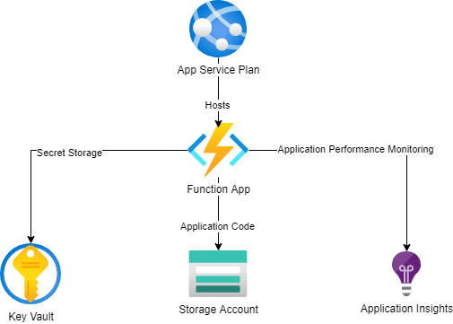

# Infrastructure Folder

This folder contains the ARM template for deploying out the Azure artifacts. The high level infrastructure is as follows:

## Purpose of Each Component

- App Service Plan => Hosts the Azure Function
- Azure Function => Application that responds to the webhook requests
- Application Insights => Application Performance Monitoring (APM) for the function
- Storage Account => Hosts the azure function code for rapid scale up
- Key Vault => Hosts secrets for the solution, this hosts the User token or the private key if the function is authenticating as a bot

## Script List

- Deploy.sh => Deploys the solution for testing
- Destroy.sh => Destroys the infrastructure deployed to Azure